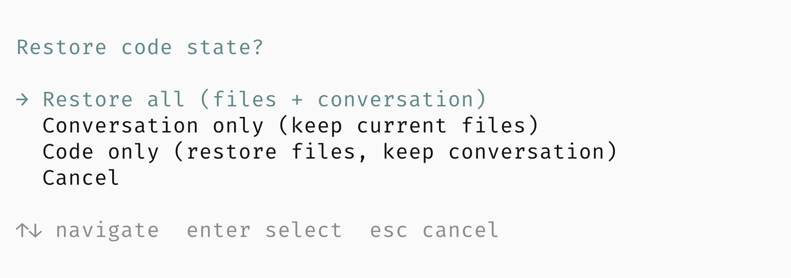
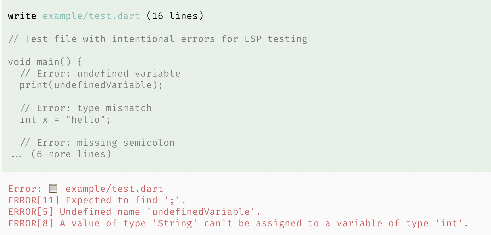

# pi-extensions

Minimal reference extensions for [`pi-coding-agent`](https://www.npmjs.com/package/@mariozechner/pi-coding-agent).

## Quick Setup

Add to `~/.pi/agent/settings.json`:
```json
{
  "extensions": [
    "/path/to/pi-hooks/checkpoint",
    "/path/to/pi-hooks/lsp",
    "/path/to/pi-hooks/permission"
  ]
}
```

Then run `npm install` in `lsp/` and `permission/` directories.

## Included Extensions

### `checkpoint/`

Git-based checkpoint system for restoring code state when branching conversations.

- Captures repo state at the start of every turn (tracked, staged, and untracked files)
- Stores checkpoints as Git refs for persistence across sessions
- Offers restore options: files + conversation, conversation only, or files only
- Automatically saves current state before restoring past snapshots



### `lsp/`

Language Server Protocol integration (hook + tool).

The package exports two extensions via `package.json`:
- `lsp-hook.ts` - Auto-diagnostics after write/edit
- `lsp-tool.ts` - On-demand LSP queries

**Hook** (auto-diagnostics):
- Runs LSP diagnostics after each `write`/`edit`
- Supports web, Flutter, and common backend stacks
- Manages LSP server lifecycles per project root

**Tool** (on-demand queries):
- Definitions, references, hover, symbols, diagnostics, signatures
- Query by symbol name or line/column position

You can load them individually or together:
```bash
# Load both (recommended)
pi --extension ./lsp/

# Load individually
pi --extension ./lsp/lsp.ts        # Just auto-diagnostics hook
pi --extension ./lsp/lsp-tool.ts   # Just the LSP tool
```



### `permission/`

Layered permission control with four permission levels:

| Level  | Description           | What's allowed                                      |
|--------|-----------------------|-----------------------------------------------------|
| Off    | Read-only mode        | Only read commands (ls, cat, git status, etc.)      |
| Low    | File edits            | + write/edit files                                  |
| Medium | Dev commands          | + npm, git, make, cargo, etc.                       |
| High   | Full access           | Everything (dangerous commands still prompt)        |

On first run you pick a level; it's saved globally. You can escalate mid-session when needed.


## Usage

1. Install dependencies for extensions that need them:
   ```bash
   cd lsp && npm install
   cd ../permission && npm install
   ```

2. **Project-scoped setup** (`.pi/extensions/`):
   ```bash
   mkdir -p .pi/extensions
   cp -r checkpoint .pi/extensions/
   cp -r lsp .pi/extensions/
   cp -r permission .pi/extensions/
   ```
   pi automatically loads extensions from `.pi/extensions/`.

3. **Global setup** (`~/.pi/agent/extensions/`):
   ```bash
   mkdir -p ~/.pi/agent/extensions
   cp -r checkpoint ~/.pi/agent/extensions/
   cp -r lsp ~/.pi/agent/extensions/
   cp -r permission ~/.pi/agent/extensions/
   ```
   
   Or via `~/.pi/agent/settings.json`:
   ```json
   {
     "extensions": [
       "/absolute/path/to/pi-hooks/checkpoint",
       "/absolute/path/to/pi-hooks/lsp",
       "/absolute/path/to/pi-hooks/permission"
     ]
   }
   ```

4. See inline comments in each extension for configuration options.

## Testing

```bash
cd checkpoint && npm test
cd lsp && npm run test:all
cd permission && npm test
```

## License

MIT
